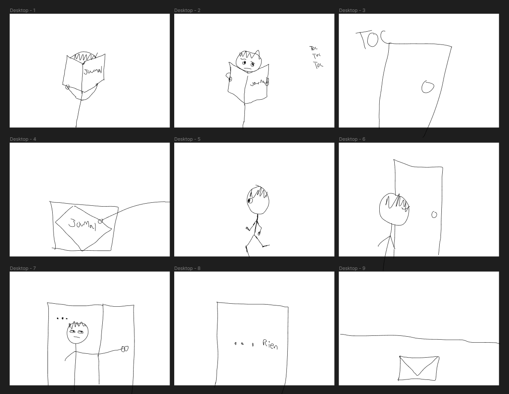

# Cours 14
## Plan de la présentation 3
Durée: 8 à 10 minutes

### Résumer votre projet en une phrase

Une histoire qui porte sur les desicions du lecteur/joueur.

### Description du projet 

Les joueurs suive l'histoire d'Hirose Takayuki un journaliste/detectif qui s'avance dans plusieurs aventure comme des meutres et autre. Chaque descisions prises par les joueurs affecterons le cours de l'histoire ce qui peut créer plusieur multiverse de celle-ci.

### Schéma du projet ou scénarimage

Le scénarinage est le debut de l'histoire ou on voit le personnage principale dans son bureau de travail. Il recoit un cognement a sa port puis y retrouve personnes, seulement une lettre a l'entré de la porte.

### Moodboard

Voici des croquis de certain endroits ou ce déroule l'histoire.

### Technologies
Décrivez quelles seront les technologies utilisées dans votre projet. 

### Tâches

écriture du script
concept de l'art
Ingénieur de logiciel
Programmation
Animation 2D
création d'effet visuel
création d'effet sonore
création de musique
gestion du projet
Testeur
